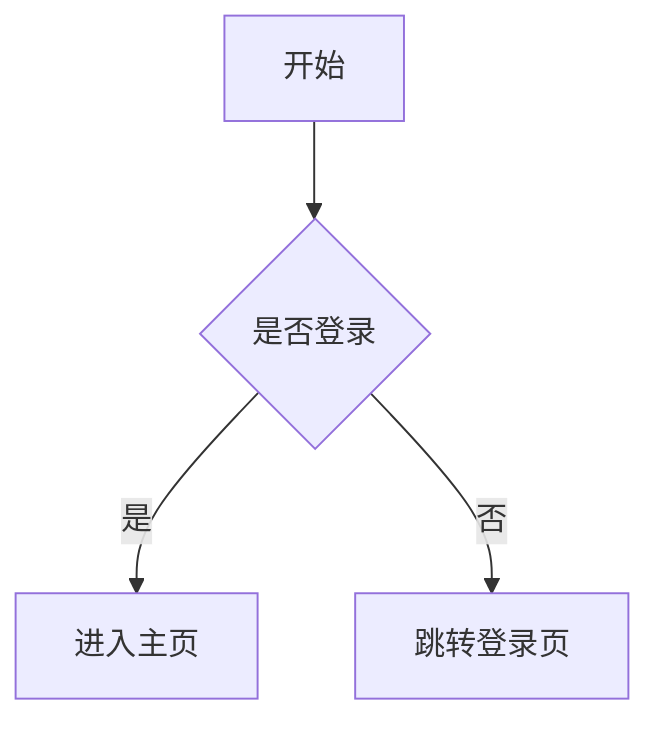
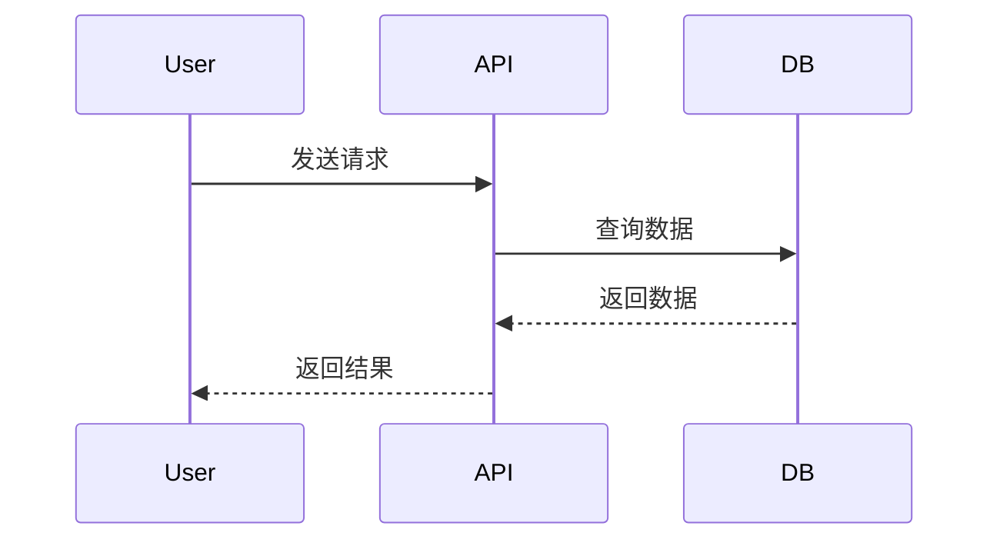

# 06-其他实用工具（Docker、Mermaid、Postman）

> 读完本文你将了解：Docker 是什么、怎么用 Mermaid 画图、Postman 和 curl 怎么测试 API、以及这些工具在 AI 开发中有什么用

---

## 你可能遇到过的问题

你在做 AI 相关项目的时候，遇到了这些情况：

- **你在自己电脑上能跑的项目，发给同学就跑不起来了**——Python 版本不同、依赖冲突
- **你想在文档里画个流程图**——画图软件太麻烦，截图又太丑
- **你想测试一个 API 能不能通**——不知道除了跑代码还有什么办法
- **别人说的 Docker、容器这些词你经常听到**——但不知道具体是什么

每个问题对应的工具都不复杂，但知道了就能省很多时间。

---

## 常见的误解

| 你以为的 | 实际的 |
|---------|--------|
| Docker 是一个虚拟机 | Docker 是**容器**——比虚拟机轻量得多，共享宿主机内核 |
| 画图必须用画图软件 | Mermaid 可以用纯文本画图，放在 Markdown 里自动渲染 |
| 测试 API 必须写代码 | curl 一行命令就能测 API，Postman 提供图形界面 |

---

## Docker：解决"在我电脑上是好的"问题

Docker 把**你的整个运行环境**打包成一个镜像，别人拉下来就能跑。

### Docker vs 虚拟机

| 维度 | 虚拟机 | Docker 容器 |
|------|--------|-----------|
| 启动速度 | 几分钟 | 几秒 |
| 大小 | GB 级别 | MB 级别 |
| 资源占用 | 高 | 低 |

### 常用 Docker 命令

```bash
# 下载一个镜像
docker pull python:3.11

# 查看镜像和容器
docker images
docker ps          # 运行中的容器
docker ps -a       # 所有容器

# 运行容器
docker run -it python:3.11 bash

# 构建自己的镜像
docker build -t 你的镜像名 .
```

### 一个简单的 Dockerfile

```dockerfile
FROM python:3.11-slim
WORKDIR /app
COPY requirements.txt .
RUN pip install -r requirements.txt
COPY . .
CMD ["python", "main.py"]
```

> **对初学者：** 不用急着学 Docker。等你做了项目之后，遇到"环境不一致"的问题时再回来看。

---

## Mermaid：用文本画图

Mermaid 是一种**用纯文本描述图表**的语言。把它写在 Markdown 里，支持 Mermaid 的编辑器会自动渲染。

### 流程图示例



对应的文本：

```
graph TD
    A[开始] --> B{是否登录}
    B -->|是| C[进入主页]
    B -->|否| D[跳转登录页]
```

### 时序图示例



### 在哪用 Mermaid

- **GitHub Markdown**（直接支持）
- **Obsidian**（插件支持）
- **VS Code**（Mermaid 插件）
- **在线编辑器**：[mermaid.live](https://mermaid.live)

---

## curl 和 Postman：测试 API

### curl：命令行

> Windows 用户注意：PowerShell 自带的 `curl` 是 `Invoke-WebRequest` 的别名，不是真正的 curl。请用 `curl.exe` 代替 `curl`。

```bash
# 测试 GET
curl https://api.github.com/users/octocat

# 测试 AI API（POST）
curl https://api.siliconflow.cn/v1/chat/completions \
  -H "Authorization: Bearer 你的 API_KEY" \
  -H "Content-Type: application/json" \
  -d '{"model": "Qwen/Qwen2.5-72B-Instruct", "messages": [{"role": "user", "content": "你好"}]}'
```

### Postman：图形界面

Postman 提供一个图形界面来构造 HTTP 请求，不需要写代码也能测试 API。

下载地址：[postman.com](https://www.postman.com)

---

## 其他实用工具一览

| 工具 | 用途 | 什么时候用 |
|------|------|-----------|
| curl | 命令行 HTTP 请求 | 快速测试 API |
| Postman | 图形化 API 客户端 | 调试复杂 API |
| Docker | 容器化应用 | 环境不一致时 |
| Mermaid | 文本画图 | 文档里画流程图 |
| jq | JSON 格式化 | `curl ... | jq .` |
| tree | 目录树 | 看清项目结构 |

---

## 你现在应该做什么？

1. 装 curl，试一下用命令行调 AI API（上面有示例）
2. 在 Obsidian 或 GitHub 的 Markdown 里写一段 Mermaid 流程图
3. 剩下的工具**用到再学**——Docker 等遇到环境问题再装，Postman 等需要调 API 再用

---

## 更进一步

- [Docker 入门教程](https://docs.docker.com/get-started/)
- [Mermaid 官方文档](https://mermaid.js.org)
- [Postman 学习中心](https://learning.postman.com)

---

**要点总结**
- **Docker 解决"在我电脑上是好的"问题**——把环境打包，别人拉走就能跑
- **Mermaid 用纯文本画图**——写进 Markdown 自动渲染
- **curl 是测试 API 最快的工具**——完全不用写代码
- 这些工具**用到再学**，不需要提前掌握
