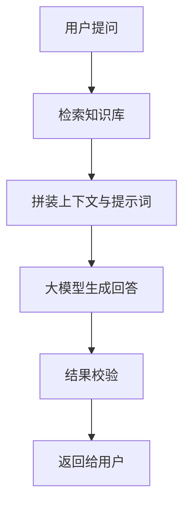
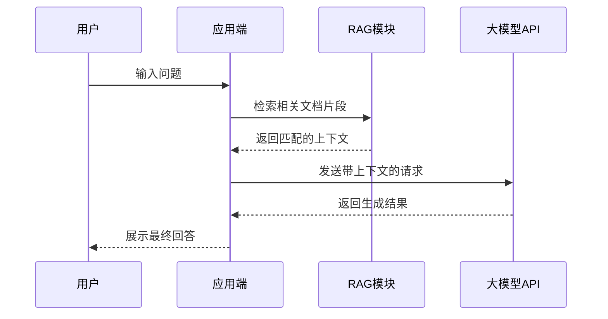

# 06-实用工具三件套：Docker、Mermaid、Postman

> 读完本文你将了解：Docker 如何解决环境不一致问题、怎么用 Mermaid 用文本画技术图表、curl 与 Postman 怎么快速调试 API，以及这些工具在 AI 开发中的具体用途
> 注：本文只讲核心价值与入门操作，不用一次性全学会，遇到对应场景再深入即可。

---

## 你可能遇到过的问题

你在做 AI 项目、写技术文档的过程中，大概率会遇到这些痛点：

- **自己电脑上能跑的项目，发给同学/传到服务器就报错**——Python 版本、依赖版本全对不上，调环境比写代码还久
- **想画个模型架构图、Agent 工作流**——专门开画图软件太麻烦，截图粘贴又没法修改，格式还不统一
- **想测试大模型 API 通不通、参数效果如何**——每次都要写 Python 脚本运行，调试起来太繁琐
- **总听人说 Docker、容器、镜像**——感觉很高深，不知道自己什么时候才需要学，要不要提前掌握

这些问题对应的工具都不复杂，但知道了就能省大量时间。

---

## 常见的误解

| 你以为的 | 实际的 |
|---------|--------|
| Docker 就是虚拟机，又重又麻烦 | Docker 是容器技术，共享系统内核，比虚拟机轻量得多，启动仅需几秒 |
| 画图必须用 Visio、ProcessOn 这类软件 | Mermaid 用纯文本就能画流程图、架构图、时序图，直接嵌入 Markdown 自动渲染 |
| 测试 API 必须写 Python 代码 | curl 一行命令就能发请求，Postman 有图形界面，调试接口比写代码快得多 |
| Docker 只有上线部署才用得到 | 开发阶段就能用它统一团队环境、复现论文代码、本地部署开源大模型，用处很多 |
| Mermaid 只能画简单的小流程图 | 从架构图、时序图到甘特图、状态图都支持，AI 还能直接帮你生成完整代码 |

---

## 常见问题快速解决

| 你遇到的问题 | 快速操作 |
|-------------|---------|
| 项目换个环境就跑不起来 | 先写好 `requirements.txt` 统一依赖，进阶用 Docker 打包完整运行环境 |
| 想画流程图不想开笨重的画图软件 | 直接用 Mermaid 写文本代码，描述清楚逻辑 AI 就能帮你生成 |
| 快速验证 API 能不能调通 | 用 curl 发一行 POST 请求，立刻就能看到返回结果 |
| 要调试很多 API、多套参数环境 | 用 Postman 保存为接口集合，用环境变量管理不同密钥 |
| curl 返回的 JSON 挤在一起看不懂 | 管道符接 `| jq .` 自动格式化高亮，还能快速提取字段 |

---

## Docker：彻底解决「在我电脑上是好的」

Docker 的核心作用，是把**你的代码 + 完整运行环境**（Python 版本、所有依赖、系统配置）整体打包成一个「镜像」。别人拿到镜像就能直接运行，从根本上消除环境不一致的问题。

### 容器 vs 传统虚拟机
很多人会把 Docker 和虚拟机混为一谈，二者本质完全不同：

| 维度 | 传统虚拟机 | Docker 容器 |
|------|-----------|------------|
| 启动速度 | 数分钟 | 1~2 秒 |
| 体积 | 数 GB 级别 | 数 MB ~ 数百 MB |
| 资源占用 | 高，自带独立操作系统内核 | 低，共享宿主机系统内核 |
| 隔离性 | 极强 | 较强，满足绝大多数开发场景 |

### 最常用的核心命令
不用记太多命令，入门掌握这几个就足够：
```bash
# 拉取官方基础镜像
docker pull python:3.12-slim

# 查看本地镜像、查看容器状态
docker images
docker ps          # 仅显示运行中的容器
docker ps -a       # 显示所有容器（含已停止）

# 交互式进入容器
docker run -it python:3.12-slim bash

# 根据 Dockerfile 构建自己的项目镜像
docker build -t my-ai-project .
```

### AI 项目极简 Dockerfile 示例
```dockerfile
# 基础镜像：指定 Python 版本，slim 版本更轻量
FROM python:3.12-slim

# 设置容器内工作目录
WORKDIR /app

# 先复制依赖文件，利用镜像缓存加速后续构建
COPY requirements.txt .

# 安装项目依赖
RUN pip install --no-cache-dir -r requirements.txt

# 复制项目全部代码
COPY . .

# 容器启动命令
CMD ["python", "main.py"]
```

### AI 开发中的典型用途
1. **本地部署开源大模型**：一键拉起 Llama、Qwen 等模型，不用手动配置复杂的 CUDA、依赖环境
2. **复现论文/开源项目**：绝大多数 AI 开源项目会提供 Dockerfile，直接构建就能跑，避开大量环境坑
3. **团队协作统一环境**：所有人用同一个镜像开发，不会出现「我这能跑你那不行」的玄学问题
4. **避免污染本地环境**：测试不同版本的依赖、不同框架，直接开容器就行，不会搞乱本地 Python

> 💡 新手建议：不用刚入门就学 Docker。先把虚拟环境 venv/uv 用好，等你需要分享项目、复现开源代码、部署应用的时候，再回来学也完全来得及。

---

## Mermaid：用纯文本画技术图表

Mermaid 是一套基于 Markdown 文本的绘图语法，你只用写简单的文本描述，就能自动渲染出专业规整的图表，完美嵌入 Markdown 文档，而且 AI 可以直接帮你生成代码，是技术写作与文档整理的神器。

### AI 开发最常用的三类图
#### 1. 流程图（最高频）
适合画 Agent 工作流、系统架构、执行逻辑，比如 RAG 系统流程：



对应的文本代码：
```
graph TD
    A[用户提问] --> B[检索知识库]
    B --> C[拼装上下文与提示词]
    C --> D[大模型生成回答]
    D --> E[结果校验]
    E --> F[返回给用户]
```

#### 2. 时序图
适合画 API 调用流程、多模块交互逻辑：


除此之外，Mermaid 还支持状态图、甘特图、类图、饼图等，能覆盖绝大多数技术文档的绘图需求。

### 支持的平台
几乎所有主流开发工具都原生或通过插件支持 Mermaid：
- **GitHub**：原生支持，README、Issue、Wiki 里直接写就能渲染
- **Obsidian**：原生支持，笔记里可直接嵌入交互式图表
- **VS Code**：安装 Mermaid 插件即可实时预览
- **在线编辑**：[mermaid.live](https://mermaid.live) 在线编写、预览、导出图片

### AI 辅助用法
- 直接描述需求生成：「帮我用 Mermaid 画一个多 Agent 协作的工作流程图」
- 格式转换：「把这张截图里的流程图转成 Mermaid 代码」
- 优化调整：「帮我优化这段 Mermaid 代码的布局，让结构更清晰」

---

## curl & Postman：快速调试 API

调试大模型接口、第三方工具 API 是 AI 开发的日常。不用每次都写 Python 脚本，这两个工具能让你快速验证接口、调试参数。

### curl：命令行最快方案
curl 是绝大多数系统自带的命令行 HTTP 工具，一行命令就能发请求，适合快速验证接口通不通、返回格式是否正确。

> Windows PowerShell 注意：自带的 `curl` 是 `Invoke-WebRequest` 的别名，使用原生 curl 请输入 `curl.exe`。

常用示例：
```bash
# 测试 GET 请求
curl https://api.github.com/users/octocat

# 测试大模型 API（POST 请求）
curl https://api.siliconflow.cn/v1/chat/completions \
  -H "Authorization: Bearer 你的API_KEY" \
  -H "Content-Type: application/json" \
  -d '{"model": "Qwen/Qwen3.7-72B-Instruct", "messages": [{"role": "user", "content": "你好"}]}'

# 配合 jq 自动格式化 JSON 返回（更易读）
curl https://api.github.com/users/octocat | jq .
```

### Postman：图形化 API 开发平台
Postman 是全球最主流的 API 开发测试平台，全球超 4000 万开发者使用，98% 的财富 500 强企业都在采用。相比 curl，它有完整的图形界面，适合调试复杂接口、管理大量 API。

#### 核心能力
- **可视化构造请求**：GET/POST 方法、请求头、请求体都可以界面化配置，不用手写命令
- **集合与环境变量**：把同类 API 保存为集合，用环境变量区分测试/生产密钥，管理更清晰
- **内置 AI 助手 Postbot**：自动生成测试脚本、可视化返回结果、辅助排查接口问题
- **原生支持 MCP 协议**：适配 AI 智能体开发，可直接作为 Agent 的工具调用端
- 进阶支持自动化测试、Mock 服务、团队协作等功能

下载地址：[postman.com](https://www.postman.com)

### AI 开发中的典型用途
1. 快速验证大模型 API 的不同参数效果，不用每次改代码再运行
2. 调试第三方工具 API，确认返回格式后再写进项目代码
3. 保存常用的 API 请求集合，不同项目的密钥用环境变量隔离
4. 配合 AI 生成测试用例，批量验证接口稳定性与边界情况

---

## 其他轻量实用工具一览

| 工具 | 核心用途 | 适用场景 |
|------|---------|---------|
| jq | 命令行 JSON 格式化、字段提取 | curl 返回结果美化、快速取指定字段 |
| tree | 生成目录树结构 | 展示项目文件结构、写文档说明 |
| tldr | 简化版命令行帮助文档 | 忘了命令参数时，比系统 man 页更简洁易懂 |
| htop | 终端进程资源监控 | 查看大模型运行时的显存、CPU 占用 |

---

## 你现在应该做什么？

1. 打开终端，用 curl 调用一次大模型 API，感受直接发请求的效果
2. 在你的笔记或项目 README 里，写一段 Mermaid 流程图，渲染出来看看效果
3. 剩下的工具**用到再学**：Docker 等你需要分享项目、复现代码时再装，Postman 等你需要频繁调试 API 时再深入

---

## 更进一步

- [Docker 官方入门指南](https://docs.docker.com/get-started/) — 境外站点，国内访问可能受限
- [Mermaid 官方文档](https://mermaid.js.org) — 完整语法与所有图类型说明
- [Postman 官方学习中心](https://learning.postman.com) — 从入门到进阶的完整教程

---

**要点总结**
- **Docker 解决环境一致性问题**，把代码+依赖整体打包，从根本上消除「我电脑上能跑」的玄学问题
- **Mermaid 用纯文本绘图**，无缝嵌入 Markdown，AI 可以直接帮你生成代码，是技术文档的必备工具
- **curl 是最快的 API 测试工具**，一行命令就能验证接口；Postman 适合复杂接口调试与批量管理
- 这些工具都不用提前死学，**遇到对应场景再入手完全来得及**，先掌握核心用法，深入功能按需探索